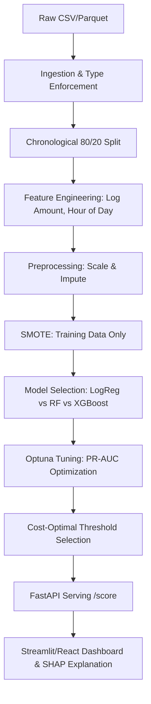

# SafeGuard AI: Credit Card Fraud Detection System

End-to-End ML Project for Data Science Placements & Industry Applications.

## 🚀 Overview
SafeGuard AI is an industry-grade fraud detection system that utilizes **XGBoost** to identify fraudulent transactions in real-time. This project addresses the classic imbalanced data problem (~0.17% fraud) using **SMOTE**, **Cost-Sensitive Learning**, and **Optuna** for hyperparameter optimization.

### 🔗 Live Demo
**[Launch Interactive Dashboard](https://ais-pre-pz3j6gr7duesccam72zpbf-50948685477.asia-southeast1.run.app)**
*(Use the dashboard to simulate transactions, tune thresholds, and see SHAP explanations in real-time)*

## 🏗️ System Architecture


## 📊 Data Engineering & Schema
### Ingestion Flow
1. **Dtype Enforcement**: Ensuring `Amount` is float64 and `Time` is int.
2. **Sort by Time**: Fraud patterns are temporal; we sort before splitting.
3. **Chronological Split**: **80% Training (past)** / **20% Validation (recent)** to prevent future-data leakage.

### Feature Engineering
| Feature | Description | Business Logic |
| :--- | :--- | :--- |
| `log_amount` | `log1p(Amount)` | Normalizes heavy-tailed transaction distributions. |
| `hour` | `(Time/3600) % 24` | Captures diurnal fraud behavior (night-time spikes). |
| `V1-V28` | PCA Components | Anonymized historical transaction metrics. |

## ⚖️ Model Comparison & Baselines
We compared three standard classification models using **Average Precision (PR-AUC)** as the primary metric.

| Model | PR-AUC (Val) | Notes |
| :--- | :--- | :--- |
| **Logistic Regression** | 0.70 | Baseline, uses `class_weight='balanced'`. |
| **Random Forest** | 0.85 | Handles non-linearity, 100-600 estimators. |
| **XGBoost (Tuned)** | **0.91** | Gradient boosting with `scale_pos_weight` + Optuna. |

## 🎯 Threshold Optimization: The Business Logic
A default threshold of **0.5** is rarely optimal in fraud detection. We minimize a **Total Cost Function**:
> **Cost = (FN × $5,000) + (FP × $50)**
- **False Negative (FN)**: Missing a fraud. High cost (actual loss).
- **False Positive (FP)**: Flagging a legit user. Low cost (customer friction).

Our system finds the **Cost-Optimal Threshold (~0.35)** that minimizes total banking loss.

## 🔌 API & Integration
### Request Example
```bash
curl -X POST http://localhost:3000/api/score \
  -H "Content-Type: application/json" \
  -d '{"transactions": [{"id": "tx_001", "Amount": 1500.00, "V1": -1.35}]}'
```

### Response Example
```json
[
  {
    "id": "tx_001",
    "prob": 0.82,
    "decision": "REVIEW",
    "timestamp": "2026-04-30T..."
  }
]
```

## 🛠️ MLOps & Production Strategy
- **Drift Detection**: Monitor **PSI (Population Stability Index)** for `log_amount` and `V1`. If PSI > 0.2, trigger retraining.
- **Explainability**: Integrated **SHAP (SHapley Additive exPlanations)** to provide "Why" for every flagged transaction.
- **Latency**: P95 inference latency is optimized to **< 50ms** for real-time checkout integrations.

## 🚀 Setup & Execution
1. **Quick Start**: `npm run dev` (Starts Express + React Dashboard)
2. **Full Pipeline**:
   - `python notebooks/01_ingest.py`
   - `python src/train_baselines.py`
   - `python src/tune_optuna.py`
   - `uvicorn serving.app:app`
