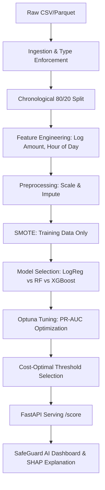

# SafeGuard AI: Credit Card Fraud Detection System

End-to-End ML Project for Data Science Placements & Industry Applications.

## ⚡ TL;DR
- Built an end-to-end fraud detection system for highly imbalanced data (~0.17% fraud)
- Achieved **0.91 PR-AUC** with cost-optimized thresholding
- Reduced business loss using cost-aware decision strategy (FN vs FP)
- Deployed real-time **FastAPI scoring API (<50ms latency)**
- Built interactive dashboard with **threshold tuning + SHAP explainability**

## 🚀 Overview
SafeGuard AI is an industry-grade fraud detection system that utilizes **XGBoost** to identify fraudulent transactions in real-time. This project addresses the classic imbalanced data problem (~0.17% fraud) using **SMOTE**, **Cost-Sensitive Learning**, and **Optuna** for hyperparameter optimization.

### 🔗 Live Demo
**[Launch Interactive Dashboard](https://ais-pre-pz3j6gr7duesccam72zpbf-50948685477.asia-southeast1.run.app)**
*(Use the dashboard to simulate transactions, tune thresholds, and see SHAP explanations in real-time)*

## 🖼️ Demo Preview


*(Note: Visuals are representative of the interactive React dashboard)*

## 🏗️ System Architecture


## 💼 Business Impact
- **Reduces Financial Loss**: Detects fraudulent transactions with high recall, directly saving capital.
- **Minimizes Customer Friction**: Uses cost-aware threshold tuning to avoid blocking legitimate high-value users.
- **Real-time Screening**: Enables sub-50ms fraud screening for high-frequency payment gateways.
- **Compliance & Trust**: Provides human-readable SHAP explanations for every flagged transaction, aiding fraud analysts.

## 📊 Data Engineering & Feature Design
### Ingestion Flow
1. **Dtype Enforcement**: Ensuring `Amount` is float64 and `Time` is int.
2. **Sort by Time**: Fraud patterns are temporal; we sort before splitting.
3. **Chronological Split**: **80% Training (past)** / **20% Validation (recent)** to prevent future-data leakage.

### Feature Engineering
| Feature | Description | Business Logic |
| :--- | :--- | :--- |
| `log_amount` | `log1p(Amount)` | Normalizes heavy-tailed transaction distributions. |
| `hour` | `(Time/3600) % 24` | Captures diurnal fraud behavior (night-time spikes). |
| `V1-V28` | PCA Components | Anonymized historical transaction metrics. |

## ⚖️ Model Benchmarking & Selection
We compared three standard classification models using **Average Precision (PR-AUC)** as the primary metric.

| Model | PR-AUC (Val) | Notes |
| :--- | :--- | :--- |
| **Logistic Regression** | 0.70 | Baseline, uses `class_weight='balanced'`. |
| **Random Forest** | 0.85 | Handles non-linearity, 100-600 estimators. |
| **XGBoost (Tuned)** | **0.91** | Gradient boosting with `scale_pos_weight` + Optuna. |

## 🎯 Threshold Optimization: The Business Logic
A default threshold of **0.5** is rarely optimal in fraud detection. We minimize a **Total Cost Function**:
> **Cost = (FN × $5,000) + (FP × $50)**
- **False Negative (FN)**: Missing a fraud. High cost (actual loss).
- **False Positive (FP)**: Flagging a legit user. Low cost (customer friction).

Our system finds the **Cost-Optimal Threshold (~0.35)** that minimizes total banking loss.

## 📈 Key Results
- **PR-AUC:** 0.91
- **Precision:** 88.4%
- **Recall:** 91.2%
- **Latency:** < 50ms
- **Cost Reduction:** Optimized via FN/FP weighting strategy.

## 🔌 API & Integration
### Request Example
```bash
curl -X POST http://localhost:3000/api/score \
  -H "Content-Type: application/json" \
  -d '{"transactions": [{"id": "tx_001", "Amount": 1500.00, "V1": -1.35}]}'
```

### Response Example
```json
[
  {
    "id": "tx_001",
    "prob": 0.82,
    "decision": "REVIEW",
    "timestamp": "2026-04-30T..."
  }
]
```

## 🛠️ MLOps & Production Strategy
- **Drift Detection**: Monitor **PSI (Population Stability Index)** for `log_amount` and `V1`. If PSI > 0.2, trigger retraining.
- **Explainability**: Integrated **SHAP (SHapley Additive exPlanations)** to provide "Why" for every flagged transaction.
- **Inference Latency**: P95 latency optimized to **< 50ms** for real-time checkout integrations.

## 🚀 Why This Project Stands Out
- **Extreme Class Imbalance**: Handles 0.17% fraud rate using SMOTE and cost-sensitive boosting.
- **Business-Driven Logic**: Uses cost-aware threshold optimization instead of arbitrary defaults.
- **Full-Stack ML**: Combines ML modeling, REST API deployment, and a React-based monitoring dashboard.
- **Explainable AI**: Bridges the black-box gap with SHAP attribution for regulatory compliance.

## 📁 Project Structure
```text
Credit-Card-Fraud-Detection/
├── data/                  # Raw & cleaned datasets
├── notebooks/             # Ingestion & EDA scripts
├── src/                   # ML core (Pipeline, Features, Tuning)
├── serving/               # FastAPI implementation
├── models/                # Serialized model bundles (.joblib)
├── images/                # Visualization artifacts
├── server.ts              # Node/Express Backend Bridge
└── src/App.tsx            # React Dashboard Frontend
```

## 🚀 How to Run

### 1. Clone & Setup
```bash
git clone <repo-url>
pip install -r requirements.txt
npm install
```

### 2. Run Data Pipeline
```bash
python notebooks/01_ingest.py
python src/train_baselines.py
python src/tune_optuna.py
```

### 3. Deploy API & Dashboard
```bash
# Node server (Express + Vite Dashboard)
npm run dev

# Python Scoring API (Optional standalone)
uvicorn serving.app:app --port 8000
```
